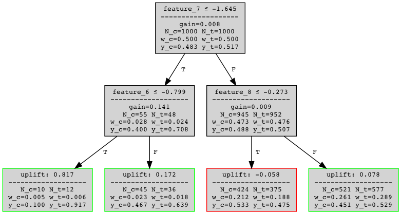

```{r setup, include=FALSE}
knitr::opts_chunk$set(echo = FALSE)

# Learn more about creating blogs with Distill at:
# https://rstudio.github.io/distill/blog.html

```
*This post provides a **very** brief overview of my own, original adaptation
of the AdaBoost algorithm to the problem of (heterogeneous) causal
effect estimation as part of my undergraduate thesis on causal machine learning.
It also includes a light introduction to boosting and
uplift modelling, though a basic knowledge of probabilities and decision
trees is assumed.*

# Background

Uplift modelling is a branch of machine learning that aims to predict
the *causal* effect of an action ("treatment") on a given *individual*
[@Gutierrez2017]. To illustrate, consider a marketing campaign where
individuals either do or don't receive a particular ad (the treatment),
and the outcome is whether they made a purchase. The goal is to select
individuals most likely to respond positively to the campaign. Causal
effect estimation has also seen use in many fields outside of marketing,
including medicine, A/B testing and econometrics.

We consider a formalism of the problem in terms of the potential
outcomes framework [@Rubin1974]. Given a dataset of $N$ independent and
identically distributed $(X_i, W_i, Y_i)$ where $X_i \in \mathcal{X}$ are
per-individual features, while $W_i \in \{0, 1\}$ and $Y_i \in \{0, 1\}$
denote the individual's treatment assignment and outcome respectively.
Let $\{Y_i(0), Y_i(1)\}$ be the potential outcomes we would have
observed had individual $i$ be assigned treatment $W_i=0$ or $1$
respectively. The causal effect of treatment on individual $i$ is the
Individual Treatment Effect (ITE), defined as:

$$\tau_i := Y_i(1) - Y_i(0)$$

Unfortunately, ITE is not identifiable as we cannot simultaneously
observe both potential outcomes: we only observe $Y_i=Y_i(W_i)$ (this is
often referred to as the *Fundamental Problem of Causal Inference*).
Instead, we seek to estimate the conditional average treatment effect
(CATE): 

$$\tau(\mathbf x) := \mathbb E[Y(1) - Y(0) \mid X=\mathbf x]$$

> **Assumption 1** (Unconfoundedness). *Potential outcomes are independent of treatment assignment:
$\{Y_i(0), Y_i(1)\} \perp W_i \mid X_i$*


In order to identify the CATE, we assume unconfoundedness (**Assumption
1**) which yields the result (proof in the Appendix): 

$$\begin{align}
\tau(\mathbf x) &= \mathbb E[Y(1) \mid X=\mathbf x] - \mathbb E[Y(0) \mid X=\mathbf x]  \nonumber \\
    &= \mathbb E[Y \mid W=1, X=\mathbf x] - \mathbb E[Y \mid W=0, X=\mathbf x] \label{eq:cateuplift}
\end{align}$$

which is often referred to as the *uplift*. Unconfoundedness means that
$W_i$ only affects *which* of the potential outcomes
$\{Y_i(0), Y_i(1)\}$ is observed, without affecting *how* they are each
generated.

The uplift literature will often make another, stronger assumption that
the data originates from a randomised control trial (RCT):


> **Assumption 2** (Randomised Treatment Assignment).
$e(X_i) = 0.5 = (1-e(X_i))$

where we write $e(X_i) = \Pr(W_i = 1 \mid X_i)$ for the treatment
propensity. That is, each individual is equally likely to be assigned to the treatment or control group.

# Uplift Trees

The straightforward way to model uplift is to estimate
$\mathbb E[Y| W=1, X=\mathbf x]$ and $\mathbb E[Y| W=1, X=\mathbf x]$
separately. However, since it is not the absolute values of the
responses, but the *differences* in potential outcomes that matter when
estimating treatment effect, modelling $\tau(\mathbf x)$ directly can
produce better results.

To that end, Rzepakowski and Jaroszewicz propose a modified decision
tree for direct uplift estimation [@Rzepakowski2012]. Their procedure is
similar to fitting a normal decision tree, in that the model is built by
greedily partitioning $\mathcal X$ into regions $R_1, \ldots, R_J$ (each
of which corresponds to a leaf node in the tree) according to a
splitting criterion.

Since the more ubiquitous splitting criteria based on maximising class
homogeneity don't apply (recall: we can't observe $\tau_i$), the authors
propose several criteria based on maximising the divergence between the
treatment and control distributions $(Y|W=1), (Y|W=0)$. They argue that,
of these, Euclidean distance is superior because of its symmetry and
stability. For a binary tree with binary $W_i$, this reduces to
maximising (further details in the Appendix):

$$
\begin{equation}
    \mathcal C^\mathrm{Euclidean} := 
\Pr(\mathbf x \in R_\mathrm{Left}) \hat\tau(R_\mathrm{Left})^2 + 
\Pr(\mathbf x \in R_\mathrm{Right}) \hat\tau(R_\mathrm{Right})^2 \label{eq:utobjective} \end{equation}
$$

when splitting into left and right child nodes with regions
$R_\mathrm{Left}, R_\mathrm{Right}$. We write $\hat\tau(R_j)$ for the
empirical average treatment effect in region $R_j$ (over our training
set):

$$
\begin{equation}
\hat \tau(R_j) := \mathbb E[Y \mid W=1, \mathbf x \in R_j] - \mathbb E[Y \mid W=0, \mathbf x \in R_j] 
\end{equation}
$$

The prediction at each leaf node of the tree is then the empirical
average treatment effect in the associated region.



Lastly, Rzepakowski and Jaroszewicz also propose a regularisation
technique penalising splits that produce imbalanced treatment and
control groups.

# Boosting

Some of the best performing models on classical machine learning
problems are those based around *boosting* an ensemble of weak learners
(usually trees). Thus, a natural progression from Rzepakowski and
Jaroszewicz' decision tree is to ask whether it can be boosted.

## Background

Boosting takes a basis function $h : \mathcal X \to \mathbb R$ and
produces an additive model
$H_T(\mathbf x) = \sum_{t=1}^T \alpha_t h_t (\mathbf x)$. Typically, the
ensemble is fit by minimising a (convex and differentiable) loss
function $L$ over the training data:

$$
\begin{equation}
\label{eq:boosting}
    \min_{\{\alpha_t, h_t \}_1^T} \sum_{i=1}^N L(y_i, \sum_{t=1}^T \alpha_t h_t(\mathbf x_i))
\end{equation}
$$

Often, this is not a feasible computation. <mark>Forward Stagewise Additive
Modelling (FSAM)</mark> approximates the solution to
($\ref{eq:boosting}$) by greedily fitting each basis function. We
start by initialising $H_0(\mathbf x) := 0$. Then, at each iteration $t$
we solve for the optimal basis function $h_t$ and corresponding weight
$\alpha_t$, *given* the functions we have already fit: 

$$
\begin{equation}
\label{eq:fsam}
    h_{t+1}, \alpha_{t+1} = \mathrm{argmin}_{h \in \mathcal H, \alpha \in \mathbb R^+} \sum_{i=1}^N L(y_i, H_t(\mathbf x_i)+\alpha h(\mathbf x_i))
\end{equation}
$$

and update our ensemble: $H_{t+1} := H_t + \alpha_{t+1} h_{t+1}$.

One way to solve for ($\ref{eq:fsam}$) is *gradient descent in functional space*. We
write $\ell(H_t) = \sum_{i=1}^N L(y_i, H_t(x_i))$ for our total loss. Fixing a
small step-size $\alpha$, we can use a Taylor approximation on
$\ell(H_t + \alpha h)$ to find an almost optimal $h$: 

$$
\begin{align}
    \mathrm{argmin}_{h \in \mathcal H} \ell (H_t + \alpha h) 
    &\approx \mathrm{argmin}_{h \in \mathcal H} \;\ell (H_t) + \alpha \langle \nabla \ell (H_t), h \rangle \nonumber \\
    &= \mathrm{argmin}_{h \in \mathcal H} \; \langle \nabla \ell (H_t), h \rangle \nonumber\\
    &= \mathrm{argmin}_{h \in \mathcal H} \sum_{i=1}^N \frac{\partial \ell}{\partial [H_t(\mathbf x_i)]} h(\mathbf x_i) \label{eq:vecapprox}\\
    &= \mathrm{argmax}_{h \in \mathcal H} \sum_{i=1}^N \underbrace{-\frac{\partial \ell}{\partial [H_t(\mathbf x_i)]}}_{t_i} h(\mathbf x_i) \label{eq:graddesc}
\end{align}
$$

In ($\ref{eq:vecapprox}$), we use the fact that a function $f(\cdot)$
in our functional space is completely specified by its values on our
training set $f(\mathbf x_1), \ldots, f(\mathbf x_n)$, and hence can be
considered a vector $\vec f \in \mathbb R^N$.

The final result ($\ref{eq:graddesc}$) has the intuitive interpretation of finding
the basis function $h$ closest to the negative gradient of the loss
$\vec t$. Note that $h$ need not be perfectly optimal to make progress.
As long as $\sum_{i=1}^N t_i h(\mathbf x_i) > 0$ (that is, the basis
function & negative gradient lie on the same side of the hyperplane),
our loss $\ell$ will decrease. This is the *weak learner* condition: our
basis function must be better than a random function $h_R$, for which we
would expect $\sum_{i=1}^N t_i h_R(\textbf x_i) = 0$.

## AdaBoost

One of the most popular, and earliest, boosting algorithms is the
AdaBoost algorithm [@Freund1995]. It was
later shown to be a special case of FSAM, with $y_i \in \{-1, 1\}$,
$h(\mathbf x_i) \in [-1,1]$ ^[Here we refer to the Real AdaBoost algorithm [@Schapire1998] that relaxes the original $h(\mathbf x_i) \in \{-1, 1\}$ assumption of Discrete AdaBoost [@Freund1995].] and optimising for exponential loss [@Hastie2009]: 

$$
\begin{equation}
L(y, f(x)) = \exp({-y f(x)})
\end{equation}
$$

First, we show that $\ell(H_t)$ at each iteration is equivalent to
minimising loss for the basis function under a re-weighted distribution:

$$
\begin{align}
    h_{t+1} 
    &= \mathrm{argmax}_{h \in \mathcal H} \sum_{i=1}^N t_i h(\mathbf x_i) \nonumber \\
    &= \mathrm{argmax}_{h \in \mathcal H} \sum_{i=1}^N -\left[\frac{\partial}{\partial H_t(\mathbf x_i)} \sum_{i=1}^N \exp(-y_iH_t(\mathbf x_i))\right] h(\mathbf x_i) \nonumber \\
    &= \mathrm{argmax}_{h \in \mathcal H} \sum_{i=1}^N \exp(-y_i H_t(\mathbf x_i)) y_i h(\mathbf x_i) \nonumber \\
    &= \mathrm{argmax}_{h \in \mathcal H}\; \frac{1}{\sum_{i=1}^N \exp(-y_i H_t(\mathbf x_i))} \sum_{i=1}^N \exp(-y_i H_t(\mathbf x_i)) y_i h(\mathbf x_i) \nonumber \\
    &= \mathrm{argmax}_{h \in \mathcal H} \mathbb E_{i \sim D_t} [y_i h(\mathbf x_i)] \label{eq:adaobjective} \\ 
\end{align}
$$

where
$D_t(i) = \frac{\exp(-y_i H_t(\mathbf x_i))}{\sum_{j=1}^N \exp(-y_j H_t(\mathbf x_i))} = \frac{1}{Z_t}\exp(-y_i H_t(\mathbf x_i))$
is the weight associated with $i^\mathrm{th}$ training sample. Note that
the normalisation factor $Z_t$ is identical to the total loss
$\ell(H_t)$. Each weight $D_t(i)$ can be interpreted as the relative
contribution of the $i^\text{th}$ training sample to the total loss.
Moreover, in the discrete case where $h(\mathbf x_i) \in \{-1,1\}$, the
learning objective
($\ref{eq:adaobjective}$) is equivalent to maximising accuracy under
the re-weighted distribution.

Most boosting algorithms do not yield a tractable solution for the
optimal step-size $\alpha_{t+1}$ (hence $\alpha$ is often left as a
fixed hyperparameter). However, AdaBoost is exceptional in that we can
find a (near) optimal step-size. A consequence is that AdaBoost
converges fast and overfits slowly [@Hastie2009].

In order to find the optimal $\alpha_{t+1}$, consider the FSAM
minimisation procedure ($\ref{eq:fsam}$): 

$$
\begin{align}
    \alpha_{t+1}
    &= \mathrm{argmin}_{\alpha \in \mathbb R^+} \sum_{i=1}^N \exp(-y_i (H_t(\mathbf x_i) + \alpha h(\mathbf x_i)))  \nonumber\\
    &= \mathrm{argmin}_{\alpha \in \mathbb R^+} \sum_{i=1}^N \exp(-y_i H_t(\mathbf x_i)) \exp(-\alpha y_i h(\mathbf x_i)) \nonumber\\ 
    &= \mathrm{argmin}_{\alpha \in \mathbb R^+} \mathbb E_{i \sim D_t} [\exp(-\alpha y_i h(\mathbf x_i))] \label{eq:alphaobjective} \\ 
\end{align}
$$

Schapire and Singer propose an upper bound on the objective
($\ref{eq:alphaobjective}$):

$$
\begin{equation}
\mathbb E_{i \sim D_t}[\exp(-\alpha y_i h(\mathbf x_i))] \leq \mathbb E_{i \sim D_t}\left[\frac{1+y_i h(\mathbf x_i)}{2} e^{-\alpha} + \frac{1-y_i h(\mathbf x_i)}{2} e^{\alpha}\right]
\end{equation}
$$

this upper bound is valid since $y_i h(\mathbf x_i) \in [-1, 1]$ ^[In fact, it is an exact bound for Discrete Adaboost since
    $y_i h(\mathbf x_i) \in \{-1, 1\}$.]. The
step-size minimising the upper bound can be found analytically, giving:

$$
\begin{equation}\alpha_{t+1} = \frac{1}{2} \ln (\frac{1+r_{t+1}}{1-{r_{t+1}}})\end{equation}
$$ 

where $r_{t+1} = \mathbb E_{i \sim D_t} [y_i h(\mathbf x_i)]$.

# Boosting Uplift Trees

We now return to our original question: is it possible to apply a
boosting algorithm (in particular, the AdaBoost algorithm) to
Rzepakowski and Jaroszewicz' uplift decision tree? Once again, the
*Fundamental Problem of Causal Inference* adds a difficulty: there is no
obvious labelling to use as we cannot observe the ground truth $\tau_i$.

Let us consider the following simple class transformation:

$$
\begin{equation}
\hat Y_i := 
    \begin{cases}
        +1 & \mathrm{if}\; W_i = Y_i \\ 
        -1 & \mathrm{otherwise}\; (W_i \neq Y_i)
    \end{cases}
\end{equation}
$$ 
    
We naïvely assume there is a positive causal effect
for positive outcomes in the treatment group or negative outcomes in the
control group, and a negative causal effect otherwise.

Since $\hat Y_i \in \{-1, 1\}$, it is a suitable label for AdaBoost. To
find the function that would be estimated by the model, we first examine
the exponential loss population minimiser:

$$
\begin{equation}
f^*(x) = \mathrm{argmin}_{f(x)}\mathbb E_{Y \mid x}\exp{(-Y f(x))} = \frac{1}{2} \log \frac{\Pr(Y=1 \mid x)}{\Pr(Y=-1 \mid x)}
\end{equation}
$$

which can easily be found analytically.

The relevant probability for $\hat Y$ is: 

$$
\begin{align}
    \Pr(\hat Y = 1 | X = \mathbf x)
    ={}& e(\mathbf x)\Pr(Y = 1 | W=1, X = \mathbf x) \nonumber \\
    &+ (1-e(\mathbf x))\Pr(Y = 0 | W=0, X=\mathbf x) \nonumber \\
    ={}& e(\mathbf x)\mathbb E[Y \mid W=1, X=\mathbf x] \nonumber \\ 
    &+ (1-e(\mathbf x))(1-\mathbb E[Y \mid W=0, X=\mathbf x])
\end{align}
$$ 

If we assume random treatment assignment (**Assumption
2**), this gives: 

$$
\begin{align}
    \Pr (\hat Y = 1 | X = \mathbf x)
    &= \frac{1}{2}\mathbb E[Y \mid W=1, X=\mathbf x] + \frac{1}{2}(1-\mathbb E[Y \mid W=0, X=\mathbf x]) \nonumber \\ 
    &= \frac{1}{2} + \frac{1}{2} \tau (\mathbf x)
\end{align}
$$ 

In fact, under random treatment assignment $\hat Y$ is
an unbiased estimator of $\tau(\mathbf x)$: 

$$
\begin{align}
    \mathbb E[\hat Y = 1 | X= \mathbf x] 
    &= (\frac{1}{2} + \frac{1}{2}\tau(\mathbf x)) - (\frac{1}{2} - \frac{1}{2}\tau(\mathbf x)) \nonumber \\ 
    &= \tau(\mathbf x)
\end{align}
$$ 

Hence, AdaBoost with labels $\hat Y_i$ yields the additive model: 

$$
\begin{align}
    H_T(\mathbf x)
    &\approx \mathrm{argmin}_{\{\alpha_t, h_t\}_1^T} \mathbb E_{\hat Y \mid \mathbf x}\exp\left ({-\hat Y \left [\sum_{t=1}^T \alpha_t h_t(\mathbf x)\right ]} \right ) \nonumber \\ 
    &=\frac{1}{2} \log \frac{\Pr(\hat Y = 1 |X=\mathbf x)}{\Pr(\hat Y = -1 \mid X=\mathbf x)} \nonumber \\
    &=\frac{1}{2} \log \frac{1+ \tau(\mathbf x)}{1 - \tau(\mathbf x)}
\end{align}
$$ 

Which with a simple transformation gives us the desired
estimator:

$$
\begin{equation}
\hat H_T(\mathbf x) := 2 \left[\frac{1}{1+e^{-2 H_T(\mathbf x)}}\right] - 1 \approx \tau(\mathbf x)
\end{equation}
$$

Having demonstrated that AdaBoost with labels $\hat Y_i$ can directly
model uplift, we now show that Rzepakowski and Jaroszewicz' uplift
decision tree is a suitable weak learner.

The first requirement, that $h(\mathbf x_i) \in [-1, 1]$, is trivially
satisfied: for any leaf node $R_j$ we have $\hat \tau(R_j) \in [-1, 1]$.
Next, we show that, after re-weighting, the basis function objective
($\ref{eq:adaobjective}$) with labels $\hat Y$ is approximately the
same as the decision tree fitting objective
($\ref{eq:utobjective}$):

$$
\begin{align}
    \mathbb E_{i \sim D_t}[\hat Y_i h(\mathbf x_i)] 
    &= \sum_{j=1}^J \mathbb E_{i \sim D_t}[\hat Y_i h(\mathbf x_i) | \mathbf x_i \in R_j] \Pr_{i \sim D_t}(\mathbf x_i \in R_j) \label{eq:sumnodes}\\
    &= \sum_{j=1}^J \hat \tau(R_j) \mathbb E_{i \sim D_t}[\hat Y_i | \mathbf x_i \in R_j] \Pr_{i \sim D_t}(\mathbf x_i \in R_j) \nonumber \\
    &= \sum_{j=1}^J \hat \tau(R_j) \mathbb E_{i \sim D_t} [\tau(\mathbf x_i) | \mathbf x_i \in R_j] \Pr_{i \sim D_t}(\mathbf x_i \in R_j) \label{ass:objrct} \\ 
    &= \sum_{j=1}^J \hat \tau(R_j)^2 \Pr_{i \sim D_t}(\mathbf x_i \in R_j)
\end{align}
$$ 

where in ($\ref{eq:sumnodes}$) we apply the law of total probability to sum
over the tree's leaf nodes.

The reasons why the tree only approximates the objective
($\ref{eq:adaobjective}$) are twofold. First, splits are chosen
greedily. Second, ($\ref{ass:objrct}$) relies on (**Assumption 2**). Even if it holds
on the dataset (the root node), it may not hold within child nodes.
However, the regularisation proposed by Rzepakowski and Jaroszewicz can
alleviate this. Moreover, as previously discussed we only require that
our basis function be better than random, thus in practice the tree
remains suitable.

> **Algorithm** Uplift AdaBoost \
> **Input:** training set $\{(\mathbf x_i, w_i, y_i)\}$, number of iterations $T$
> 
> 1. *Set boosting labels $\hat y_i = w_i(2y_i - 1) + (1-w_i)(1 - 2y_i)$*
> 2. *Initialise weights $D_1(i) = \frac{1}{N}, i = 1, \ldots, N$*
> 3. *For $t=1$ to $T$:*
>    a. *Fit uplift tree $h_t$ with splitting criterion $\mathcal C^\text{Euclidean}$ to the training set using weights $D_t(i)$*
>    b. *Compute $r_t = \sum_{i=1}^N D_t(i) \hat y_i h(\mathbf x_i)$*
>    c. *Compute step-size $\alpha_t = \frac{1}{2} \ln(\frac{1+r_t}{1 - r_t})$*
>   d. *Update weights $D_{t+1}(i) = \frac{1}{Z_t} D_t(i) \exp(-\alpha_t \hat y_i h_t(\mathbf x_i))$*
> 4. *Output ensemble $\hat H_T(\mathbf x) = 2\left( {1+\exp({-2[\sum_{t=1}^T \alpha_t h_t(\mathbf x)]})} \right)^{-1} - 1$*

The final algorithm is a modification of Real AdaBoost with proxy labels
$\hat y$, and using Rzepakowski and Jaroszewicz' uplift tree rather than
a traditional decision tree. 

Conveniently, the weight initialisation (step 2) allows us to drop (**Assumption 2**). If we have a consistent
estimator of propensity $\hat e(\mathbf x)$, we can instead choose
weights $D_1(i) = \frac{1}{Z}(1/\hat e(\mathbf x_i))$ and $D_1(i) = \frac{1}{Z}(1/(1-\hat e(\mathbf x_i)))$ for treatment and control samples respectively. Under this new distribution (**Assumption
2**) holds.

# Conclusion

After a brief introduction to uplift modelling, we have shown that it is
theoretically possible to boost Rzepakowski and Jaroszewicz' uplift tree
without observing the ground truths $\tau_i$. This is achieved using a
surprisingly simple and naïve class transformation $\hat Y_i$. In the
next part of this series, we will examine the modified boosting
algorithm's performance, and discuss some of the challenges that come
with producing useful evaluation metrics without access to the ground
truths.

## Proof of ($\ref{eq:cateuplift}$) {.appendix}
By definition: 

$$
\begin{aligned}
    \tau(\mathbf x) ={}& \mathbb E[Y(1) - Y(0) | X = \mathbf x] \\ 
    ={}& \mathbb E[Y(1) | W=1, X=\mathbf x]e(\mathbf x) + \mathbb E[Y(1) | W=0, X=\mathbf x](1-e(\mathbf x)) \\
    & - \mathbb E[Y(0) | W=1, X=\mathbf x]e(\mathbf x) - \mathbb E[Y(0) | W=0, X=\mathbf x](1-e(\mathbf x)) \\
    ={}& \mathbb E[Y(1) | W=1, X=\mathbf x]e(\mathbf x) + \mathbb E[Y(1) | W=0, X=\mathbf x](1-e(\mathbf x)) \\
    & - \mathbb E[Y(0) | W=1, X=\mathbf x]e(\mathbf x) - \mathbb E[Y(0) | W=0, X=\mathbf x](1-e(\mathbf x)) \\ 
    & + \mathbb E[Y(1) | W=1, X=\mathbf x](1-e(\mathbf x)) - \mathbb E[Y(1) | W=1, X=\mathbf x](1-e(\mathbf x)) \\ 
    & + \mathbb E[Y(0) | W=0, X=\mathbf x]e(\mathbf x) - \mathbb E[Y(0) | W=0, X=\mathbf x]e(\mathbf x) \\
    ={}& \mathbb E[Y(1) | W=1, X=\mathbf x] - \mathbb E[Y(0) | W=0, X=\mathbf x](1-e(\mathbf x)) \\
    & + e(\mathbf x)\left( \mathbb E[Y(0) | W = 0, X=\mathbf x] - \mathbb E[Y(0) | W=1, X=\mathbf x]\right) \\ 
    & + (1-e(\mathbf x)) \left(\mathbb E[Y(1) | W=0, X=\mathbf x] - \mathbb E[Y(1) | W=1, X=\mathbf x]\right)
\end{aligned}
$$

Under (**Assumption 1**), the observed outcome
$\mathbb E[Y(w) | W=w, X=\mathbf x]$ is the same as the unobserved
$\mathbb E[Y(1-w) | W=1-w, X=\mathbf x]$ which gives us:

$$
\begin{aligned}
    \tau(\mathbf x) 
    ={}& \mathbb E[Y(1) | W=1, X=\mathbf x] - \mathbb E[Y(0) | W=0, X=\mathbf x] \\ 
    ={}& \mathbb E[Y | W=1, X=\mathbf x] - \mathbb E[Y | W=0, X=\mathbf x]
\end{aligned}
$$

## Tree Splitting Criterion ($\ref{eq:utobjective}$) {.appendix}
In their paper, Rzepakowski and Jaroszewicz argue that maximising
Euclidean distance between treatment and control distributions is the
best splitting criterion. For two discrete random variables $P,Q$
with probabilities $p_i = \Pr(P=i), q_i = \Pr(Q=i)$ respectively,
their Euclidean distance is defined as:

$$D^\mathrm{Euclidean}(P, Q) = \sum_i (p_i - q_i)^2$$

Rzepakowski and Jaroszewicz consider datasets with multiple treatment
groups, and trees with $n$-way splits. If we restrict to binary
treatment with binary splits, we are left maximising: 

$$
\begin{aligned}
    \mathcal C^\mathrm{Euclidean}  ={}& D^\mathrm{Euclidean}((Y|W=1, \mathbf x \in R_\mathrm{Left}), (Y|W=0, \mathbf x \in R_\mathrm{Left})) \Pr(\mathbf x \in R_\mathrm{Left}) \\ 
    &+ D^\mathrm{Euclidean}((Y|W=1, \mathbf x \in R_\mathrm{Left}), (Y|W=0, \mathbf x \in R_\mathrm{Left})) \Pr(\mathbf x \in R_\mathrm{Left})
\\
\end{aligned}
$$ 

We can show that: 

$$
D^\mathrm{Euclidean}((Y|W=1, \mathbf x \in R_j), (Y|W=0, \mathbf x \in R_j)) \\
\begin{aligned}
    \hspace{10em}={}& [\Pr(Y=1|W=1, \mathbf x \in R_j) - \Pr(Y=1|W=0, \mathbf x \in R_j)]^2 \\ 
    & + [\Pr(Y=0|W=1, \mathbf x \in R_j) - \Pr(Y=0|W=0, \mathbf x \in R_j)]^2 \\ 
    ={}& [\mathbb E[Y | W=1, \mathbf x \in R_j] - \mathbb E[Y | W=0, \mathbf x \in R_j]]^2 \\ 
    & + [(1-\mathbb E[Y | W=1, \mathbf x \in R_j]) - (1-\mathbb E[Y | W=1, \mathbf x \in R_j])]^2 \\ 
    ={}& 2 \hat \tau (R_j)^2
\end{aligned}
$$

Hence:

$$
\mathcal C^\mathrm{Euclidean} = 2 [\hat \tau(R_\mathrm{Left})^2 \Pr(\mathbf x \in R_\mathrm{Left}) + \hat\tau(R_\mathrm{Right})^2 \Pr(\mathbf x \in R_\mathrm{Right})]
$$

(in ($\ref{eq:utobjective}$) we drop the redundant constant).
