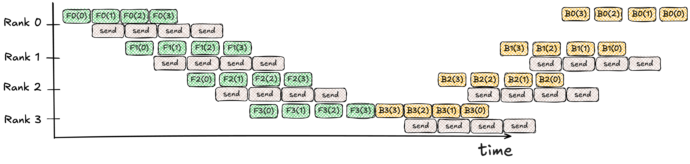

```{r setup, include=FALSE}
knitr::opts_chunk$set(echo = FALSE)

# Learn more about creating blogs with Distill at:
# https://rstudio.github.io/distill/blog.html

```

Motivation: models & clusters are *really* big.
<!-- alternatively: you've just called torch.distribute(model), and your 100x GPU cluster is only running 50x faster than local, what's happened? --> 

The objectives of distributed ML are two-fold:

1. Reduce memory impact so we can fit larger models.
2. Use lots of GPUs in parallel to speed up compute.

There's no such thing as a free lunch; by distributing training we incur a *communication* overhead when GPUs have to talk to each other.
As we'll see, it's relatively easy to design parallelisation techniques that achieve both of these; doing so without incurring prohibitive communication overheads is much more difficult, however.
We'll be focusing on the communication aspect of these designs.
We'll be particularly looking at how parallelisation paradigms are designed to minimise and hide communication, keeping our expensive GPUs as busy as possible.
The goal is to reach linear scaling: throwing twice as many GPUs at the problem should go twice as fast (or the same speed, but with a doubly large model).

We'll take a look at how parallelisation paradigms have evolved to cope with more data, more parameters and more GPUs.

I intended this as a light compilation of various sources; for more detail, I provide references to the relevant resources throughout.

[Outline of sections]
Though I intend to stay light on implementation specifics, the abstractions provided by PyTorch are nonetheless useful for illustration.
We'll be using PyTorch to illustrate and discuss implementation details. 
The first two sections provide a brief overview of model training with PyTorch, a highly-level overview of transformers and the communication building blocks that are availableto us. 
Section 3 takes a deep dive into how PyTorch assembles these together into the various parallelisation techniques it offers out-of-the-box.

# 1. PyTorch mental model
Pytorch is the preeminent framework, though the stuff here also (mostly) applies to other frameworks.
Useful for understanding how data flows throughout training.

### How do you train a PyTorch neural network?
[[Further Reading](https://pytorch.org/tutorials/beginner/basics/intro.html)]

PyTorch's fundamental data structure is the `Tensor`, a multi-dimensional matrix (think NumPy's `ndarray`) used to store a model's parameters and encode inputs/outputs. 
In PyTorch, a neural network is a `Module` composed by stitching other modules (layers) and functions together. 
For example, here's a simple network with two linear layers and a ReLU activation function in-between:

```{python, eval=FALSE, echo=TRUE}
from torch import nn

class NeuralNetwork(nn.Module):
  def __init__(self):
    super().__init__()
    self.linear1 = nn.Linear(2, 4)
    self.activation_fn = nn.ReLU()
    self.linear2 = nn.Linear(4, 1)
  
  def forward(self, x):
    x = self.linear1(x)
    x = self.activation_fn(x)
    x = self.linear2(x)
    return x
```
Unsurprisingly, `forward` defines the network's forward pass: how inputs are mapped to outputs. Here a 2D input is mapped to a 1D output, with a 4D "hidden" layer. Taking the first `Linear` submodule as an example, it holds weight and bias tensors of shapes `[4,2]` and `[4]` respectively. Adding the second linear layer's parameters (the activation function doesn't have any), we can see the network has a total of 17 trainable parameters.
<!-- TODO: illustration of this network? e.g. https://uvadlc-notebooks.readthedocs.io/en/latest/tutorial_notebooks/tutorial2/Introduction_to_PyTorch.html --->

This is all well and good, but we can't actually train the network yet! 
For that we need a basic training loop:

```{python, eval=FALSE, echo=TRUE}
model = NeuralNetwork() 
optimizer = torch.optim.Adam(model.parameters(), lr=0.1)
X = torch.ones(10, 2) # input batch tensor
y = torch.zeros(10, 1) # expected output (target) batch tensor

epochs = 10
for t in range(epochs): 
  # Compute prediction and loss
  pred = model(x)
  loss = torch.nn.functional.cross_entropy(pred, y)
  
  # Update parameters
  loss.backward()
  optimizer.step()
  optimizer.zero_grad()
```

We train our model for 10 epochs (iterations) over a single batch of 10 (identical) data samples^[In practice an epoch will loop over an entire training set consisting of several batches (each with their own parameter updates), potentially followed by evaluation on separate validation batches.].
In each epoch:

1. With `model(x)`, we call the `forward` method defined earlier to obtain predictions for the entire input batch. The outputs of each layer (**"activations"**) are cached for use in the backward pass. 
2. We compute the (cross entropy) loss for these predictions and store them in the `loss` tensor.
3. We calculate the derivative of the loss of each sample with respect to each parameter with `loss.backward()`. PyTorch's autograd does this automatically by building a computational graph in the forward pass, and then applying backpropagation starting from the outer layer in the backward pass. It accumulates gradients in each tensor's `.grad` attribute^[Some tensors in a module don't have gradients, for example fixed transformers with static parameters.].
4. The optimizer defines how parameters are updated from gradients. `optimizer.step()` performs this adjustment, and `optimizer.zero_grad()` resets gradients so they don't accumulate in the next pass.

).](images/pebble_graph.gif)

For each parameter in our network, we also need to store its gradient and relevant optimizer state.
The popular Adam optimizer tracks **momentum** and **variance**, exponential averages of the first and second moments respectively of each parameter's gradient [@adam2017]. 
The result is that each parameter can end up needing at least 16 bytes of memory, mostly attributable to high-precision optimizer state (assuming fp16/32 mixed precision^[FP16 weights and gradients + FP32 master copy of weights + FP32 momentum and variance.]) [@mixedprecision2018]. 
For larger models such as Meta's Llama 405B that's a 6.5TB memory requirement, which makes distributing model parameters over several GPUs a necessity.

PyTorch offers two execution models: **eager** mode and **graph** mode. 
In eager mode (the default), operators are immediately executed as they are encountered -- effectively, we can't "look ahead". 
Graph mode synthesises operators into a graph, which is then compiled and executed as a whole.
As of PyTorch 2.5, most of the parallelism offered only exists in eager mode -- which, as we'll see, can often lead to silly sequences of operations.

### The Transformer architecture
[[Further Reading](https://arxiv.org/pdf/1706.03762)]

The largest models trained today are transformers. 
Naturally, distributed training has evolved around the architecture, making it a valuable mental model.

# 2.Communication Primitives
[[Further Reading]](https://marek.ai/allreduce-the-basis-of-multi-device-communication-for-neural-network-training.html)

Before going into distribution strategies, we need to discuss the primitives we have available for communicating data between GPUs.

Let's start with a simple model: two GPUs (or **"ranks"**) with a point-to-point (p2p) connection -- this could be a fast NVLink interconnect if they're within the same host, or a slower InfiniBand or Ethernet network (perhaps with several hops) if they're not (more on this [later]()).

All primitives operate over a single tensor at each rank. 
The simplest thing we can do is to <mark>send</mark> a tensor from one rank and receive on the other:

<figure>
<video width="80%" autoplay loop muted>
  <source src="jupyter/media/videos/jupyter/1080p60/CollectiveP2P.mp4" type="video/mp4">
</video>
<figcaption aria-hidden="true">P2P send, circles correspond to ranks and squares to tensors.</figcaption>
</figure>

Now let's suppose we want to synchronise tensors distributed over a group (or **"collective"**) of GPUs.
One way to do this is with an <mark>AllToAll</mark> collective, a complete graph of p2p sends:

<figure>
<video width="80%" autoplay loop muted>
  <source src="videos/CollectiveAllToAll.mp4" type="video/mp4">
</video>
<figcaption aria-hidden="true">$W=4$ rank AllToAll</figcaption>
</figure>

This isn't very bandwidth efficient: a **world-size** of $W$ ranks synchronising $D$-sized tensors results in $D(W-1)$ per-GPU traffic, some of which may be contending for the same underlying network links.
Moreover, we often only need an *aggregate* of the distributed tensors -- for example we might want to average some parameters we've replicated across the ranks. 
So how might we accomplish this with less bandwidth? 
If each rank **reduces** (applying an associative^[Floating point addition is not associative, but in practice the difference is small enough to be safely ignored.] operator e.g. sum, min, max, etc.) the tensor it receives with its own local tensor, before passing the result onto the next rank, we obtain a **ring-based** <mark>Reduce</mark> collective:

<figure>
<video width="80%" autoplay loop muted>
  <source src="videos/CollectiveReduce.mp4" type="video/mp4">
</video>
<figcaption aria-hidden="true">$W=4$ rank Reduce</figcaption>
</figure>

After completing one loop around the ring, we've reduced all of the tensors into a single tensor -- but this result is only held in the last rank.
We need to complete another loop so that each rank holds a replica of the resulting tensor. 
This is the <mark>Broadcast</mark> collective:

<figure>
<video width="80%" autoplay loop muted>
  <source src="videos/CollectiveBroadcast.mp4" type="video/mp4">
</video>
<figcaption aria-hidden="true">$W=4$ rank Broadcast</figcaption>
</figure>

Notice that, in the latter two collectives, only one rank/link at a time is busy, with the rest idle.
We can use pipelining to get better throughput: we split the tensor into $W$ chunks, with the $r^\text{th}$ rank at the start (or **root**) of the ring corresponding to the $r^\text{th}$ chunk.
The pipelined analogs of Reduce and Broadcast are <mark>ReduceScatter</mark> and <mark>AllGather</mark> respectively.
Sequencing the two together results in the composite <mark>AllReduce</mark> collective:

<figure>
<video width="80%" autoplay loop muted>
  <source src="videos/CollectiveAllReduce.mp4" type="video/mp4">
</video>
<figcaption aria-hidden="true">$W=4$ rank AllReduce</figcaption>
</figure>

The ReduceScatter and AllGather collectives correspond to the first and second loops in the above animation.
Notice we obtain the same result we would have had with an AllToAll followed by local reductions at each rank.
However, with its use of a ring, AllReduce improves communication overhead by an order of magnitude. 
Each GPU will send a $\frac{D}{W}$-size datachunk $W-1$ times for the ReduceScatter and $W-1$ times for the AllGather, for a total per-GPU traffic of $2(W-1)\frac{D}{W}$. Crucially, this is independent of the number of GPUs in the collective!

Though Ring AllReduce is bandwidth optimal, its end-to-end latency scales *linearly* with the number of ranks. A lower latency, tree-based alternative will be discussed in another post.
<!-- TODO: summary table of each collective, overhead, latency, etc -->

# 3. Parallelisation Paradigms
In order to have some notion of correctness, let's define a distributed algorithm to be **locally consistent** if it is mathematically equivalent to local training.

<!-- TODO: summary table of parallelisation paradigms, and their compute/communication costs -->

### Distributed Data Parallel (DDP)
[[Further Reading]](https://www.vldb.org/pvldb/vol13/p3005-li.pdf)

As its name would imply, DDP splits our *dataset* across ranks (each with an identical copy of the model), with periodic synchronisation to ensure model replicas are consistent. DDP is useful when our model is still small enough to fit on a single GPU, but we'd like to speed up training by having several GPUs work on a single batch in parallel.

We described local training in [Section 1](#how-do-you-train-a-pytorch-neural-network): at each iteration we load the next batch, perform a forward pass while caching each layer's activations, and calculate the loss. Then we run the backward pass to calculate gradients, before our optimizer updates parameters. 

).](images/local_training.png)

DDP duplicates the model across $W$ ranks, splitting batches into $W$ chunks^[In practice we may use larger batches, so that the per-GPU batchsize remains relatively similar.] for each rank to process:

).](images/ddp_training.png)

Without any communication overhead, this should result in a linear $W\times$ speedup. 
The forward and backward passes are independent sample-wise calculations^[Except for batch-wise operations like `BatchNorm`, which won't be locally consistent (unless we use their expensive synchronised implementations like `SyncBatchNorm`).], and hence our batches can be independently processed without any communication.

<aside style="margin-bottom: -200%">Why don't we synchronise *parameters* rather than *gradients*?
If we're using stochasting gradient descent, there wouldn't be any difference:
$$
\begin{align*}
\theta' ={}& \theta + \eta \nabla \theta\\ 
={}& \theta+\eta \frac{1}{W} \sum_{r=0}^W \nabla \theta_r^\text{local}\\
={}& \frac{1}{W}\sum_{r=0}^W (\theta+\eta \nabla \theta_r^\text{local})
\end{align*}
$$
However, state updates for stateful optimizers like Adam are non-linear functions of the gradient, and thus we would lose local consistency as optimizer states diverge.</aside>

To achieve local consistency, we need to synchronise our gradients before the optimizer step so that the weight updates at each rank are the same.
Conveniently, the most commonly used loss functions are means over the sample-wise losses in the batch:

$$
\text{loss}(\text{batch}) = \frac{1}{\text{batchsize}} \sum_{j=0}^\text{batchsize} \text{loss}(\text{fwd}(\text{input}_j), \text{target}_j)
$$
Because the gradient of a sum is the sum of the gradients of each term, we can calculate gradients for the chunks at each rank independently and average them together to obtain the gradient over the entire batch:

$$
\nabla \theta = \frac{1}{W}\sum_{r=0}^W \nabla \theta_r^\text{local}
$$
This can be done efficiently using the previously discussed AllReduce collective (along with a single Broadcast from the root rank after model construction, to synchronise initial parameters).

#### DDP in PyTorch
PyTorch's distribution API is designed for non-intrusive scaling out from local training. 
Applying DDP to a model is as simple as wrapping our local model with the DDP `nn.Module` class: `nn.parallel.DDP(model, process_group=...)`.
The **process group** (PyTorch's abstraction for a group of processes that run collectives together) allows us to specify what communication backend to use, and which ranks to distribute over.
Care should be taken to ensure the batches processed by each rank are different (e.g. with the `DistributedSampler` dataloader class).

A naive implementation of DDP would synchronise gradients only after running a full forward and backward pass, and then subsequently calling `optimizer.step()`.
This is suboptimal as it divides training into two distinct phases: one where we're waiting for backpropagation to finish computing while the network is idle, and another where the network is communicating as fast as possible while our expensive GPUs are doing (almost) nothing:

).](images/ddp_naive.png)

Notice in the above that gradients for later layers are already available while we're still computing the backward pass of earlier layers.
For example, the gradients of Layer3 are ready while we're backpropagating through Layer2. 
This allows us to overlap computation with (non-blocking) communication, speeding up the complete iteration:

).](images/ddp_overlap.png)

Collective communications are more efficient on large tensors. Therefore, in practice, rather than launching a dedicated AllReduce immediately as soon as a layer's gradient tensor is ready, we use **Gradient Bucketing**: we wait for a short period and bucket multiple tensors at a time into one AllReduce.

To non-intrusively integrate with its eager execution model, PyTorch implements DDP by registering one autograd **hook** (a callback) with each parameter tensor, which fires after the corresponding gradients are updated (during the `loss.backward()` call).
Once all hooks in a bucket^[Bucket size is user-configurable. Larger buckets lower communication overhead but reduce overlap with compute. Buckets are allocated heuristically during model construction, by the reverse order of `model.parameters()`.] have fired, an asynchronous AllReduce is triggered. PyTorch's DDP paper [@pytorchddp] shows interleaving brings significant performance gains, particularly when using the recommended NCCL communication backend:

![Per-iteration normalised latency breakdown, comparing non-overlapping vs overlapping communication; training on 32 GPUs across 4 machines. Figure from [@pytorchddp].](images/pytorch_ddp_perf.png)

Amortised communication overhead can be further reduced with **Gradient Accumulation**: rather than synchronising gradients every iteration, we accumulate (via the `no_sync` context manager) the gradients of $n$ local training iterations before synchronising gradients globally and updating parameters. 
[@pytorchddp] claims this enables near-linear scaling for smaller GPU clusters, with "negligible accuracy penalty":

![Per-iteration latencies (left), and final training loss (right) for $n$ iterations of gradient accumulation. Figure from [@pytorchddp].](images/pytorch_ddp_grad_accum.png)

Lastly, it's worth noting that batch-size limits the maximum degree of DDP parallelism.
If we split the same batch over more GPUs, the per-GPU batchsize decreases and so does compute intensity/efficiency.
We could increase overall batchsize, but training becomes less stable.


### Fully-Sharded Data Parallel (FSDP)
[[Further Reading](https://arxiv.org/pdf/2304.11277)]

DDP speeds up training by distributing our dataset across multiple ranks, but what happens when our model can't fit within a single GPU?
DDP's newer alternative, FSDP, addresses this by also splitting model parameters.
FSDP is a PyTorch native implementation of DeepSpeed's ZeRO [@zero2020], with some further optimisations.

FSDP reduces memory footprint by <mark>sharding</mark> model parameters: the model is split *horizontally* so that each rank only holds a subset (**"shard"**) of the parameters (and associated gradients and optimizer state) in any given layer.
The naive approach to guaranteeing local consistency is to compute the partial activations of a layer corresponding to the local shard, and then to communicate these activations with the other ranks before proceeding onto the next layer:


The obvious problem with this approach is that communication appears on the critical path: we can't compute the forward pass for a given layer until we've received the complete activations of the previous layer.

Instead of communicating *activations*, FSDP's approach is to communicate *parameters*. 
FSDP fully materialises parameters before computations, just as in local training, thus removing any data dependency.
However, we would need to be able to materialise parameters on a single GPU, eliminating our memory savings!
FSDP's simple solution is to partition the model into groups of layers called **units**, only instantiating one unit at a time on-demand.

So what does this look like in practice? 
Let's look at a simple six layer model (illustrated below), which we've decided to decompose into three units: `[layer0, layer3]`, `[layer1, layer2]` and `[layer4, layer5]`.
Consider what happens to `unit1` consisting of `[layer1, layer2]`:

1. Just before the forward pass through `layer1`, we materialise the parameters in `unit1` by gathering shards from peer ranks. We can do this with an AllGather (equivalent to each rank Broadcasting its own shard).
2. After completing local forward computation, we free peer shards (but keep activations).
3. Before the backward pass through `layer2`, we AllGather the shards again.
4. After gradients are calculated, we free peer shards and then ReduceScatter to sum up and shard gradients (equivalent to each rank Reducing the gradients in its shard).
5. Finally, after completing full forward & backward passes through all units, we update our shard of the parameters in the optimizer step^[Note that because the optimizer step will only operate on the sharded parameters, any optimizer that depends on global state over all parameters won't be locally consistent.].

![FSDP example with three units, fully sharded over two ranks. Figure from [@pytorchfsdp].](images/pytorch_fsdp_units.png)

In effect, FSDP decomposes DDP's AllReduce into a ReduceScatter and an AllGather in the backward and forward passes respectively -- the only extra communication incurred is when we AllGather parameters again during backpropagation.

#### Sharding Strategies
FSDP enables fine-grained trade-offs between memory footprint and communication overhead via the **sharding factor** $F$: the number of ranks over which parameters are sharded.
By setting $F=W$ (i.e. the global world size), FSDP *fully shards* the model with each rank holding only $\frac{1}{W}$ of the model (as in the above example, with $F=W=2$).

**Hybrid sharding**, sharding factors ranging between $1$ and $W$, combines both sharding and replication.
We end up with *sharding groups* $S_1, \ldots, S_\frac{W}{F}$, each consisting of $F$ ranks over which parameters are sharded, and *replication groups* $R_1, \ldots, R_F$ (directly corresponding to these shards), each consisting of $\frac{W}{F}$ ranks (one from each sharding group) over which shards are replicated. 

The AllGather+AllGather+ReduceScatter collectives, previously over all ranks, are now collectives within each sharding group, followed by an AllReduce within each replication group to synchronise gradient shards (as in DDP). This is effectively the decomposition:
$$
\nabla \theta = \frac{1}{W}\sum_{r=1}^W \nabla \theta_r^\text{local} = \frac{1}{W}\sum_{i=1}^{W/F}\sum_{r \in S_i}\nabla \theta_r^\text{local}
$$
For example, with $W=16$ ranks and $F=8$ hybrid sharding, the $r=9$ rank would AllGather parameters and ReduceScatter its gradient shard with peers in the $S_2$  sharding group, before AllReducing the gradient shard with its peer in the $R_2$ replication group:


You might've spotted that setting $F=1$ results in a single replication group (with no memory savings) -- this simplifies to vanilla DDP using AllReduce for gradient synchronisation.
It's worth noting that with any sharding strategy, ranks are expected to have distinct input batch chunks (otherwise we'd simply be duplicating gradient calculations). 

Using our traffic calculations from [Section 2](#communication-primitives), the per-GPU communication of an $M$-size model is $2(\frac{W}{F}-1)(\frac{M}{W})$ for the replication group, and $3(F-1)(\frac{M}{F})$ for the sharding group.
Clearly communication within the sharding group is much more expensive, therefore we often try to minimise the number of hops between the ranks in a sharding group -- sometimes we may even use smaller sharding factors to ensure they're within the same host.

#### FSDP in PyTorch
Just like DDP, the FSDP API is designed as a thin `nn.Module` wrapper class: `sharded_model = FSDP(model, process_group=...)`^[The actual class is `distributed.fsdp.FullyShardedDataParallel`. Note that the optimizer should be initialised *afterwards*, using the sharded module.].
Sharding strategy is set with the `sharding_strategy` arg: `FULL_SHARD`, `NO_SHARD` and `HYBRID_SHARD` correspond to aforementioned fully sharded, fully replicated and hybrid strategies respectively^[There's also `NO_GRAD_OP` which keeps parameters unsharded during the entire forward-backward computation.]. 
Before going into all the other levers that FSDP exposes to the user, let's first get a quick understanding of how it's implemented under the hood.

The communication backends (e.g. NCCL) that provide collective implementations usually require AllGather and ReduceScatter to have the same input tensor size at each rank. 
Moreover, for a fixed communication volume issuing fewer, larger collectives reduces communication overheads (as discussed in DDP's Gradient Bucketing). 
Thus, during construction FSDP concatenates all parameters (and gradients) within a unit into a single flattened 1-D `FlatParameter` tensor, along with the padding necessary to ensure equal-sized shards at each rank in the sharding group^[Before forward computation, FSDP replaces the original parameters with views into their unsharded `FlatParameter` so that autograd behaves correctly. Keeping the original parameters registered requires using the recently added `use_orig_params` flag.]. 
The `FlatParameter` tensor has the exact data layout expected by AllGather and ReduceScatter, allowing us to call the collectives directly without copying any tensors.

![`FlatParameter` example for a fully sharded ($W=F=16)$ FSDP unit, consisting of one $4 \times 3$ `nn.Linear` layer. Figure from [@pytorchfsdp].](images/pytorch_fsdp_flatparam.png)

For an $M$-size model split into $K$ units with sizes $M_1, \ldots, M_K$, where $\sum_{i=1}^K M_i=M$, the maximum memory usage is in $O(\frac{M}{F} + \max_{i=1}^K M_i)$. 
More precisely, it is the sum of the sharded parameters, gradients and optimizer state, combined with the largest unsharded unit's parameters and gradients (but *not* the more expensive optimizer state, which always remains sharded).
Conversely, even though total communication is not affected by the number of units, the number of collectives over which it is spread is $O(K)$. 
Therefore the number of units presents yet another memory-communication tradeoff.
PyTorch lets the user control this with the `auto_wrap_policy` argument to `FSDP`, or by manually wrapping individual submodules rather than a single wrapper around the entire model^[e.g. for a transformer model we'll usually wrap each transformer block, with a final wrapper around the root module sharding the initial embedding and final linear layers.].

As with DDP's Gradient Bucketing, FSDP tries to overlap communication and computation as much as possible.
Here's what that looks like for our previous three unit, six layer example:

<aside style="margin-bottom: -200%"> FSDP, like DDP, is implemented by registering forward/backward hooks as well as overriding the `forward()` method.</aside>


In DDP's backward pass, we were able to compute gradients and then asynchronously AllReduce them afterwards.
This isn't possible for FSDP's forward: we need to AllGather parameters *before* computing, and (because of eager execution) we don't know *which* `FlatParameter` to gather next -- thus we can't reorder the async AllGather of the next unit before the synchronous computation of the current unit.
The solution, implicit forward prefetching (always enabled), is to use a separate **stream** (queue of device instructions) for communication, bypassing the false dependency on the default compute stream.

You may have noticed the poor compute-communication overlap in the backward pass: the ReduceScatter for the current unit blocks the AllGather for the next, which in turn blocks the next gradient computation^[We can't get around this with an extra stream, PyTorch only uses one internal NCCL stream for a given process group.]. 
*Explicit* backward prefetching issues the AllGather for the next unit before the ReduceScatter for the current one.
To know which `FlatParameter` to gather next, FSDP records the reverse forward execution order of modules each iteration.
Two variants exist: `backward_prefetch=BACKWARD_PRE` which overlaps the next AllGather with the current gradient computation, and `BACKWARD_POST` which waits until the current parameters are freed (using less memory but reducing overlap).
By default FSDP limits the rate at which prefetch AllGathers are issued to ensure memory usage of at most two consecutive units.

FSDP makes one final optimisation: it assumes the root unit (wrapping the outermost module) holds the last layer's parameters, and does not free the root unit's parameters after the forward pass (with the intention that they are immediately re-used for backward).
Because this naively sidesteps eager execution, it doesn't always work.
In our example, it's actually unit 3 that holds the last layer and we end up AllGathering parameters we already have and are about to free!

Lastly, we should note that with hybrid sharding there would also be an async AllReduce (on yet another communication stream) for each unit after their ReduceScatter is done.

PyTorch's FSDP experiments [@pytorchfsdp] show near-linear compute scaling, though this regresses substantially for larger clusters where "a near-perfect overlap between communication and computation is no longer attainable":

![Fully-sharded training of the T5-11B transformer; TFLOPS per GPU for batchsizes 8 and 16; A100 80GB GPUs with 2Tb/s RoCE interconnects. Figure from [@pytorchfsdp].](images/pytorch_fsdp_eval.png)

<!-- Hypothesis: contention of network resources should depend on % network utilisation rather than absolute number of GPUs. So on e.g. a network designed for only 8 GPUs, we should see the subtantial dip at 8 GPUs rather than 512 like in the figure. -->

### Pipeline Parallel (PP)
[[Further Reading](https://arxiv.org/pdf/1811.06965)]

Like FSDP, pipeline parallelism aims to train models too large to fit within a single GPU.
However, rather than *sharding* the model horizontally, we ***partition*** it vertically.
Each of these partitions is referred to as a **stage**. 
Returning to our four layer network from [Section 1](#how-do-you-train-a-pytorch-neural-network), we could partition it evenly across two ranks and send intermediate activations/gradients at partition boundaries between stages:

).](images/pp_pebble_graph.gif)

This naive approach of passing a single batch from rank to rank (often referred to as **"model parallelism"**), results in severe GPU under-utilisation: only one GPU works on the batch at any given moment, so each rank is busy at most $\frac{1}{W}$ of the time.
To illustrate, here's what the same naive schedule would look like with a pipeline **depth** of four stages:


These dead zones in our schedule where GPUs are idle are called pipeline **bubbles**.
They are caused by dependencies between operations: for example, rank 2 cannot start the 2nd forward stage until it has received 1st stage intermediate outputs from rank 1.

<mark>GPipe</mark> [@gpipe] reduces bubbles by splitting a batch into **microbatches** and adding up each of their gradients to get back the gradient over the entire batch (as with DDP gradient accumulation), thus allowing more than one rank to do useful work at the same time.
Here's the same four stage example, with 4-way batch-splitting:


We can show empirically that, in this example, GPipe nearly halves the bubble time.
For a pipeline with $d$ evenly-partitioned stages and $m$ evenly-divided microbatches, a given stage spends $m$ timesteps doing useful work and $n-1$ timesteps waiting for new work to arrive during the forward pass.
Assuming both forward and backward take one unit time per microbatch, the time wasted on bubbles is:

$$
1 - \frac{2dm}{2d(m+d-1)}=1-\frac{m}{m+d-1}=\frac{d-1}{m+d-1}
$$

Our naive model parallelism example ($m=1, d=4$) has a bubble fraction of $0.75$, compared to $0.42$ for GPipe ($m=4, d=4$).
So far we've ignored communication overheads.
Unlike other parallelisation paradigms, pipelining does not require any collective communication primitives; we simply asynchronously send (p2p) intermediates as soon as they're ready.
Here's what our GPipe example looks like once we include communication:



For illustration purposes, here sending a microbatch takes longer than computing a stage (pipelining is often internode so this is not uncommon), reducing our compute efficiency.
Perfect compute-communication overlap is impossible for pipeline parallelism because necessarily we can't start working on the first microbatch until the previous stage has finished processing, and sent, the same microbatch.

Notably, pipeline parallelism is orthogonal to DDP and both can be combined to obtain a 2D parallelism similar to hybrid FSDP.
In practice, this is implemented with the pipeline as the inner dimension and with bucketed AllReduces in the outer dimension (interleaved with the backward pass of the final microbatch).

).](images/pp_dp_2d.png)

#### Activation Checkpointing
[[Further Reading](https://arxiv.org/pdf/1604.06174)]

While we've discussed ways of reducing memory demand, you may have spotted another easy target: activations.
With GPipe, stages need to cache activations for each microbatch from the start of its forward to the end of its corresponding backward.
For an $\ell$ layer network (assuming each layer is roughly equal size) with batchsize $B$, the peak per-stage memory demand for caching activations is^[A stage has $\frac{l}{d}$ layers, each of which caches $O(B)$ of activations.]:
$$
O\left(B \frac{\ell}{d}\right)
$$
With <mark>activation checkpointing</mark>^[Not to be confused with *model* checkpointing, where we periodically save the entire model to disk, usually at the end of an epoch.] (aka gradient checkpointing) [@chen2016], we only store boundary activations and recompute the forward for each microbatch when it's time to do its backward.
Boundary activations take $O(B)$ space and we only need to cache activations for a single microbatch at any given moment (while computing its gradient), reducing peak memory demand to:
$$
O\left(B+\frac{B}{m}\frac{l}{d}\right)
$$
Why can we get away with recomputing the forward without significantly impacting overall compute efficiency?

1. In practice the backward is actually much more expensive (usually twice as much) than the forward.
2. As we saw earlier pipeline parallelism can't achieve perfect compute-communication overlap. When used in conjunction with pipelining, forward recomputation can be scheduled earlier (during bubbles) as we don't need to wait for the gradients from later layers.

The original GPipe paper [@gpipe] claims that, with activation checkpointing, using $m \geq 4d$ microbatches results in "negligible" bubble overhead.

#### Other Schedules
Omit communication from here on, use the standard "tile" diagrams.

PipeDream (1F1B) [@pipedream] aims to reduce peak memory demand by reducing number of in-flight microbatches.
Warmup, steady state, and flush^[There are versions without the flush, but model versions go out-of-sync (or we need multiple versions).]
Does not change bubbles.
In the warmup phase later stages are still waiting on activations from earlier stages; conversely, when flushing the pipeline, later stages have completed their backward passes but are waiting on earlier stages to finish theirs.

![1F1B PipeDream (flushed) schedule, ignoring communication with $d=4, m=4$. Based on figure from [@pipedream].](images/pipedream_tile.png)

When does it update? All at same timestep? Or as soon as finished with all microbatches?

ZeroBubble, BFS/DFS (Llama?)

#### PP in PyTorch
How is the model staged?
We rely on balanced pipelines (even partitions). This is non-trivial in the general case; luckily it's pretty easy for transformers because they're made of equal-sized blocks.

How do we specify schedule?
How do we combine with FSDP?

### Tensor and Sequence Parallel (TP / SP)
#### TP in PyTorch

### Context Parallel (CP)
#### CP in PyTorch

<!-- ND parallelism widget, that generates a hypothetical trace of collectives -->

# 4. Parallelism in Practice
[WIP] Large models use FSDP, gigantic models use all of the above.
